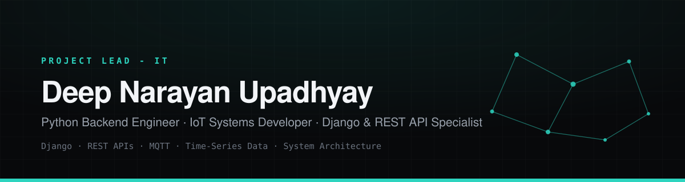
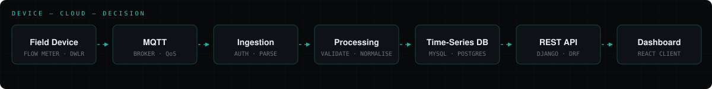

<!-- Profile README — lives at github.com/<username>/<username>.
     Keep banner.svg and pipeline.svg beside it. -->

 

**`Project Lead – IT`**  ·  Aster Technologies and Controls LLP  ·  **`3.5+ yrs`**

 

 

---

---

### ▸ Selected Work

| | | |
| :-- | :-- | :-- |
| **IoT Water Management** | Field telemetry → site monitoring → reports | `Django` `MQTT` `MySQL` `React` |
| **QR Water Dispensing** | Scan, dispense, meter-verified transactions | `Django` `IoT` `Flow Meter` |
| **Telemetry & Device Monitoring** | Ingestion, validation and device health | `MQTT` `WebSockets` `Time-Series` |
| **Industrial Sensor Platform** | RS485 registers → operational data | `RS485` `Modem` `Django` |
| **Reporting & Analytics** | Raw readings → daily / monthly / yearly | `SQL` `Django` `React` |
| **Predictive Maintenance** `concept` | Telemetry history → failure alerts | `Python` `ML` `Time-Series` |
| **Smartphone Digital Twin** `concept` | Device state as recoverable cloud state | `System Design` `Cloud` |

Full case studies, architecture diagrams and engineering notes → <a href="https://deepnarayanupadhyay.vercel.app">portfolio</a>

---

`Python Backend` · `IoT Systems` · `REST APIs` · `Data Platforms` · `System Design` · `Project Lead`

