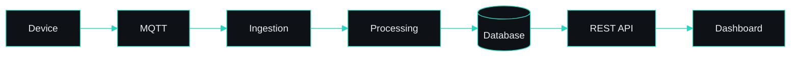
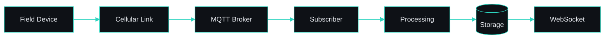
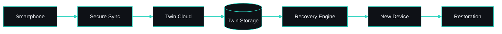

<!--
  GITHUB PROFILE README
  ---------------------
  Copy this file (and the assets/ folder next to it) into a repository named
  exactly after your GitHub username — e.g. github.com/<username>/<username> —
  as README.md in its root. GitHub then renders it on your profile page.

  Placeholders to replace before publishing:
    - <username> in the links below (currently: deep-narayan-upadhyay)
    - the portfolio URL (currently: https://deepnarayanupadhyay.vercel.app)
-->

<div align="center">


### Building backend systems that connect software, data and the physical world.

Python Backend Engineer and Project Lead specializing in Django, REST APIs,<br>
IoT platforms, data systems and automation.

<br>


<br>

[](https://deepnarayanupadhyay.vercel.app)
[](https://www.linkedin.com/in/deep-narayan-upadhyay)
[](https://github.com/deep-narayan-upadhyay)
[](mailto:aupadhydy007@gmail.com)

</div>

<br>

| `3.5+` | `Django` | `MQTT` | `End-to-end` |
| :-- | :-- | :-- | :-- |
| Years experience | Backend stack | Device telemetry | Delivery ownership |

<br>

## `01` — About

I am a **Project Lead** and **Python Backend Engineer** with 3.5+ years of experience building backend applications, REST APIs, IoT platforms, automation solutions and data-driven systems.

Most of my work sits where clean backend engineering meets physical infrastructure: field devices reporting telemetry, industrial equipment speaking its own protocols, and databases that have to turn a stream of raw readings into something an operations team can actually use.

I take projects from requirements and architecture through development, deployment, troubleshooting and delivery — designing the schemas, writing the services, integrating the devices, and coordinating the work so it ships.

**Working across**

| | |
| :-- | :-- |
| **Software Engineering** | Python and Django services, REST APIs and maintainable backend architecture |
| **IoT** | Device integration, telemetry ingestion, MQTT and cellular field connectivity |
| **Industrial Automation** | RS485 and industrial device communication bridged into modern software |
| **Data** | Schema design, query optimisation and turning raw telemetry into reports |
| **System Architecture** | End-to-end design from the device layer through ingestion, storage and dashboard |
| **Project Leadership** | Requirement analysis, technical direction, coordination and delivery |

<br>

## `02` — Experience

### Project Lead – IT · Aster Technologies and Controls LLP · `3.5+ years`

Leading and building backend and IoT systems end to end — from requirement analysis and architecture through development, device integration, deployment and ongoing troubleshooting.

| Area | Responsibilities |
| :-- | :-- |
| **Backend & APIs** | Python/Django backend development · REST API development · React applications |
| **Data & Databases** | Database architecture · MySQL and PostgreSQL |
| **IoT & Devices** | IoT integrations · Device telemetry · MQTT and WebSockets · Industrial device communication |
| **Platform & Delivery** | Cloud/VPS deployment · System architecture · Troubleshooting |
| **Leadership** | Project coordination · Requirement analysis · Technical leadership |

<br>

## `03` — Skills

| Category | Stack |
| :-- | :-- |
| **Backend** | `Python` `Django` `Django REST Framework` `REST APIs` `Microservices` `WebSockets` |
| **Database** | `MySQL` `PostgreSQL` `SQL` `Database Design` `Query Optimization` `NoSQL Fundamentals` `Time-Series Databases` |
| **Frontend** | `React` `Vite` `JavaScript` `HTML` `CSS` |
| **IoT** | `MQTT` `RS485` `Industrial Communication` `ESP32` `SIMCOM/A7672S` `Flow Meters` `DWLR` `Piezometers` `IoT Telemetry` |
| **Cloud / DevOps** | `AWS` `GCP` `Azure` `Docker` `Git` `CI/CD` `Linux` `VPS` `Vercel` |
| **AI / Data** | `Machine Learning` `Data Analytics` `Predictive Maintenance` `LLM Fundamentals` `RAG` |
| **Project Management** | `Jira` `Trello` `Asana` `Confluence` `Azure DevOps` `Requirement Analysis` `System Design` `Project Planning` |

<br>

## `04` — Featured Projects

<details>
<summary><b>01 · IoT Water Management Platform</b> — connected monitoring for water infrastructure and field devices</summary>

<br>

**Problem** — Water infrastructure is distributed across sites that are hard to reach and easy to lose visibility of. Readings lived on individual devices and in manual records, so there was no single place to see what a site was doing, whether its hardware was alive, or how consumption moved over a month or a year.

**Solution** — A Django backend that registers devices and sites, ingests telemetry from the field over MQTT and HTTP, normalises and stores it, and exposes it through REST APIs to a React dashboard. Flow-meter data is processed into daily, monthly and yearly views so operations work from the same numbers as engineering.

**Architecture**

```text
IoT Devices → Communication Layer → MQTT / HTTP → IoT Ingestion
           → Processing → Database → REST APIs → React Dashboard
```

**Tech** — `Python` `Django` `REST APIs` `MySQL` `MQTT` `IoT` `React`

**Key features** — Device integration · Telemetry ingestion · Flow-meter data · Site management · Device monitoring · Daily / historical / monthly / yearly reports · Data processing · API integrations

**Engineering challenges**
- Field devices report over unreliable cellular links, so ingestion had to tolerate gaps, retries and out-of-order payloads without corrupting stored series.
- Different device models express the same measurement differently, which pushed protocol quirks into a normalisation layer instead of leaking them into the schema.
- Reporting queries span long time ranges, so aggregation strategy and indexing mattered as much as the API design.

**Outcome** — Site and device state, live telemetry and long-range consumption reporting are served from one backend, replacing per-device inspection and manual record keeping.

</details>

<details>
<summary><b>02 · QR-Based Water Dispensing System</b> — physical dispensing machines wired to a centralised backend</summary>

<br>

**Problem** — A dispensing machine in the field has to authorise a user, release a measured volume of water and record what actually happened — all while staying in step with a backend it can only reach intermittently.

**Solution** — A QR-driven flow where a scan initiates a verified session against the Django backend, the machine dispenses, and the flow meter reports the volume actually delivered. Transactions, consumption and machine telemetry are reconciled server-side and exposed through REST APIs for monitoring and reporting.

**Architecture**

```text
QR Scan → Dispensing Machine → Device Verification → Backend API
        → Flow Meter Reading → Transaction Processing → Database → Reports & Monitoring
```

**Tech** — `Python` `Django` `REST APIs` `MySQL` `IoT` `QR` `Flow Meter` `React`

**Key features** — QR-based interaction · Water dispensing management · Flow-meter integration · Device verification · Transaction processing · Consumption tracking · Telemetry · Reporting · Machine monitoring

**Engineering challenges**
- The dispensed volume is measured by hardware, not assumed by software — the transaction record has to reflect the flow-meter reading rather than the requested amount.
- Device verification had to keep unauthorised machines and replayed requests out of the transaction path.
- Connectivity drops mid-session, so the backend needed a state model that resolves incomplete transactions instead of leaving them dangling.

**Outcome** — Dispensing hardware, user interaction and back-office reporting operate as one system, with every transaction traceable to a measured flow-meter reading.

</details>

<details>
<summary><b>03 · IoT Telemetry & Device Monitoring Platform</b> — ingestion and health monitoring for distributed field devices</summary>

<br>

**Problem** — Field deployments mix flow meters, DWLR units, piezometers, RS485 modems and ESP32-based nodes over cellular links. Each speaks slightly differently, and a silent device looks identical to a device with nothing to report.

**Solution** — A registration-and-verification model that gives every device an identity, an ingestion path that accepts MQTT and HTTP payloads, validation that rejects implausible readings before they reach storage, and device-health tracking derived from reporting behaviour. WebSockets push live state to monitoring views.

**Architecture**

```text
Field Devices → RS485 / Cellular → MQTT / HTTP Ingestion → Validation
             → Processing → Time-Series Storage → REST APIs / WebSockets → Monitoring Dashboard
```

**Devices** — `Flow meters` `DWLR` `Piezometers` `RS485 modems` `ESP32` `Cellular communication modules`

**Tech** — `Python` `Django` `REST APIs` `MQTT` `WebSockets` `MySQL` `Time-Series Data`

**Key features** — Device registration · Device verification · Telemetry ingestion · Historical data · Device health monitoring · Data validation · Data storage · Reporting · API integration

**Engineering challenges**
- Distinguishing a healthy but quiet device from a failed one required deriving health from expected reporting intervals rather than from the payload alone.
- Validation had to catch sensor drift and malformed readings at ingestion, because bad data is far more expensive once it is inside the history.
- Time-series volume grows continuously, so storage and query patterns were designed around range reads from the start.

**Outcome** — A single ingestion and monitoring layer serves heterogeneous hardware, with device identity, data validity and device health handled centrally instead of per project.

</details>

<details>
<summary><b>04 · Industrial Sensor Data Platform</b> — raw industrial telemetry turned into operational information</summary>

<br>

**Problem** — Industrial sensors emit raw register values over RS485 — accurate, but meaningless to anyone outside the panel. Getting that data off the bus, across the internet and into a form an operations team can read is the actual engineering problem.

**Solution** — A pipeline that carries readings from the sensor over RS485 to a modem, into the backend over API or MQTT, then through decoding, scaling and validation before storage. REST APIs serve the processed series to dashboards and reports.

**Architecture**

```text
Sensor → RS485 → Modem → Internet → Backend API / MQTT
       → Data Processing → Database → Dashboard / Reports
```

**Tech** — `Python` `Django` `REST APIs` `MQTT` `RS485` `MySQL` `Industrial Communication`

**Key features** — Industrial protocol handling · Modem-based connectivity · Raw payload decoding · Scaling and unit conversion · Data validation · Database architecture · API design · Operational dashboards

**Engineering challenges**
- Register maps and scaling factors vary by sensor, so decoding is configuration-driven rather than hard-coded per deployment.
- The link between panel and cloud is the weakest part of the chain, which shaped how retries and buffering are handled.
- Physical noise and momentary faults produce readings that are technically valid but operationally wrong, so plausibility checks sit ahead of storage.

**Outcome** — Sensor output that previously existed only on the bus is available as clean, queryable operational data, with the protocol and processing complexity contained in the backend.

</details>

<details>
<summary><b>05 · Reporting & Analytics Platform</b> — large volumes of device data condensed into decisions</summary>

<br>

**Problem** — Continuous telemetry is precise and unreadable at the same time. Teams need consumption per device, per site and per period — and they need it to be consistent no matter which report they open.

**Solution** — An aggregation layer over the operational database that rolls raw readings into daily, monthly and yearly series, with device-wise and site-wise breakdowns exposed through REST APIs and rendered in a React reporting interface.

**Architecture**

```text
Operational Data → Aggregation Jobs → Daily / Monthly / Yearly Rollups
                → SQL Optimisation → REST APIs → React Reporting UI
```

**Tech** — `Python` `Django` `SQL` `MySQL` `REST APIs` `React`

**Key features** — Daily / monthly / yearly reports · Historical reports · Data aggregation · Device-wise reports · Site-wise reports · Consumption analysis

**Engineering challenges**
- Reporting across long historical ranges directly from raw tables does not hold up, so rollups and indexing carry the load instead of larger queries.
- Gaps in device reporting must not silently distort a period total, which meant deciding explicitly how missing intervals are represented.
- Daily, monthly and yearly views have to agree with each other, so aggregation is defined once and reused rather than reimplemented per report.

**Outcome** — Operational and device data is delivered as consistent period reports across devices and sites, from a single aggregation definition.

</details>

<details>
<summary><b>06 · Predictive Maintenance Platform</b> — anticipating equipment failure from telemetry history <sub><code>ML initiative · concept</code></sub></summary>

<br>

> **Machine-learning initiative — not a production ML deployment.**

**Problem** — Maintenance on distributed equipment is usually reactive or calendar-based. Telemetry already captures the drift that precedes a failure, but nothing in the pipeline was reading it that way.

**Solution** — A modelling pipeline concept that cleans historical telemetry, engineers time-series features such as rolling statistics and rate-of-change, and trains models to flag anomalous behaviour and probable failure conditions, surfacing the result as a maintenance alert rather than a raw score.

**Architecture**

```text
IoT Data → Data Cleaning → Feature Engineering → Historical Analysis
         → ML Model → Anomaly / Failure Prediction → Maintenance Alert
```

**Tech** — `Python` `Machine Learning` `Data Analytics` `Time-Series Analysis` `Feature Engineering` `Predictive Analytics` `IoT`

**Key features** — Telemetry data cleaning · Time-series feature engineering · Historical behaviour analysis · Anomaly detection · Failure-condition modelling · Maintenance alerting

**Engineering challenges**
- Failure events are rare compared to normal operation, so class imbalance and label quality dominate the modelling problem.
- Sensor noise and genuine anomalies look similar in isolation and are separated mainly by temporal context.
- An alert is only useful if it arrives with enough lead time to act on, which makes the prediction horizon a design decision rather than a metric.

**Outcome** — Defines how existing IoT telemetry can be reused for condition-based maintenance, and what the data pipeline must provide for such models to be trainable.

</details>

<details>
<summary><b>07 · Smartphone Digital Twin & Disaster Recovery Architecture</b> — a cloud twin that makes a lost phone recoverable state <sub><code>system-design concept</code></sub></summary>

<br>

> **System-design concept.**

**Problem** — Smartphones fail through hardware faults, software bugs, loss or OS corruption. When that happens, users lose applications, configurations, preferences and important data — and existing backups typically restore files without restoring the device as it actually was.

**Solution** — A secure cloud-based Digital Twin representing the important aspects of the user device: configuration, application metadata, preferences, important data, device state and recovery metadata. A sync layer keeps the twin current; a recovery engine projects it onto a new device to reconstruct the environment rather than just the files.

**Architecture**

```text
Smartphone → Secure Sync Layer → Digital Twin Cloud
           → Configuration / Metadata / Data Storage → Recovery Engine
           → New Smartphone → Device Restoration
```

**Digital Twin components** — `Device Configuration` `Application Metadata` `User Preferences` `Important Data` `Device State` `Recovery Metadata`

**Demonstrates** — `Distributed Systems` `Cloud Architecture` `Data Synchronization` `Disaster Recovery` `Device State Management` `Security` `System Design`

**Engineering challenges**
- The twin holds the most sensitive data a person owns, so encryption and key custody are the first design constraint, not a hardening step.
- Sync must be incremental and conflict-aware — a device that goes offline mid-change should converge, not diverge.
- Restoration targets different hardware and OS versions, so the twin stores intent and metadata rather than a byte-for-byte image.
- Continuous synchronisation competes with battery and data budgets, making sync cadence an explicit trade-off.

**Outcome** — A reference architecture for treating a personal device as recoverable state, covering synchronisation, secure storage, versioning and deterministic restoration.

</details>

<br>

## `05` — Architecture Lab

<details>
<summary><b>IoT Data Pipeline</b> — from field device to dashboard</summary>

<br>



- Ingestion is decoupled from processing so a burst of device traffic cannot stall validation.
- Every payload is authenticated against a registered device identity before it is accepted.
- Normalisation absorbs per-model protocol differences so the schema stays stable.

</details>

<details>
<summary><b>QR Water Dispensing Architecture</b> — scan, verify, dispense, reconcile</summary>

<br>


- The recorded volume comes from the flow-meter reading, never from the requested amount.
- Device verification sits ahead of the transaction path to keep unauthorised units out.
- Incomplete sessions are resolved server-side rather than left dangling on the machine.

</details>

<details>
<summary><b>MQTT Device Communication</b> — publish / subscribe over unreliable links</summary>

<br>



- Topics are scoped per device so authorisation and routing follow the same structure.
- QoS and retained messages cover the gap when a device drops mid-publish.
- Device health is derived from reporting cadence, so silence is itself a signal.

</details>

<details>
<summary><b>Smartphone Digital Twin</b> — device state as recoverable cloud state</summary>

<br>



- The twin stores configuration, application metadata, preferences, important data, device state and recovery metadata.
- Encryption and key custody are a first-order design constraint, not a hardening pass.
- Restoration is deterministic and hardware-agnostic because the twin holds intent, not a byte image.

</details>

<details>
<summary><b>Predictive Maintenance Pipeline</b> — telemetry history to maintenance alert</summary>

<br>


- Failure events are rare, so label quality and class imbalance dominate the modelling problem.
- Temporal context is what separates sensor noise from a genuine anomaly.
- The prediction horizon is a design decision: an alert with no lead time has no value.

</details>

<br>

## `06` — Engineering Approach

| | | | |
| :-- | :-- | :-- | :-- |
| **`01` Understand the Problem**<br><sub>Start with the operational reality — what is being measured, who needs the output, and what the system has to guarantee.</sub> | **`02` Design the Architecture**<br><sub>Map the flow from device to dashboard: protocols, ingestion, processing, storage and API boundaries.</sub> | **`03` Build the Backend**<br><sub>Django services and REST APIs on a schema that fits the data model rather than fighting it.</sub> | **`04` Integrate Devices & APIs**<br><sub>Bring field hardware online over MQTT, HTTP, RS485 and cellular modems, and connect external systems.</sub> |
| **`05` Process & Store Data**<br><sub>Validate, normalise and aggregate raw telemetry into structures reports and dashboards can query.</sub> | **`06` Test & Troubleshoot**<br><sub>Verify against real device behaviour, not just happy-path payloads, and trace issues across the full path.</sub> | **`07` Deploy**<br><sub>Ship to cloud or VPS infrastructure with a repeatable, documented process.</sub> | **`08` Monitor & Improve**<br><sub>Watch device health and data quality in production, then close the gaps that show up in the field.</sub> |

<br>

## `07` — Education

| Qualification | Year |
| :-- | :-- |
| **B.Tech – Computer Science & Engineering**<br><sub>Undergraduate engineering foundation in computer science — algorithms, systems, databases and software development.</sub> | `2021` |
| **MBA – Information Technology**<br><sub>Postgraduate management education focused on information technology, adding a business and delivery perspective to engineering work.</sub> | |

<br>

## `08` — Career Profile

| | | |
| :-- | :-- | :-- |
| **`3.5+` Years Experience**<br><sub>Building and leading backend and IoT projects in production settings.</sub> | **`Python` Backend**<br><sub>Django and Django REST Framework as the core engineering stack.</sub> | **`IoT` & Automation**<br><sub>Field devices, industrial protocols and telemetry pipelines.</sub> |
| **`REST` API Development**<br><sub>Documented APIs powering dashboards, reports and integrations.</sub> | **`System` Design**<br><sub>End-to-end architecture from the device layer through to reporting.</sub> | **`Project` Leadership**<br><sub>Requirements, coordination and technical direction through delivery.</sub> |

<br>

## `09` — Let's build something useful.

Whether you're looking for a backend engineer, IoT developer, technical project lead or someone who can bridge business requirements with engineering execution, let's connect.

<div align="center">

<br>

[](https://deepnarayanupadhyay.vercel.app)
[](https://www.linkedin.com/in/deep-narayan-upadhyay)
[](mailto:aupadhydy007@gmail.com)

<br>
<sub>Python Backend Engineer · IoT Systems Developer · Django & REST API Specialist · Project Lead</sub>

</div>
